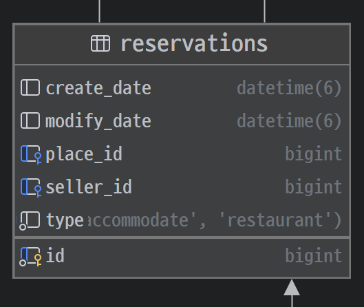

## 소개 📝

### 💡 내 여행지로 🗺 만든 지도! 뚜르드몽드!

뚜르드몽드는 “지도 기반 참여형 공유 커뮤니티”로서 당신의 여행경험을 📍다양한 지도로 만들 수 있게 도와드리고 있어요!😉🌈

## 팀원 👨‍👨‍👧‍👧👩‍👦‍👦

- 이성규(팀장, 회의 주도, 요구사항 명세서 작성, DB 설계, 게시판 개발)
- 김동하(프레젠테이션, 발표자료 작성, 요구사항 명세서 작성, DB 설계, 지도 레퍼런스)
- 손경이(서기, 회의록 작성, 요구사항 명세서 작성, DB 설계, 에약/결제 레퍼런스)
- 심규대(요구사항 명세서 작성, DB 설계, 회원관리 레퍼런스)
- 이예원(ERD 다이어그램 작성, 요구사항 명세서 작성, DB 설계, 회원관리 레퍼런스)
- 전희영(프로젝트 문서 관리, 요구사항 명세서 작성, DB 설계, 예약/결제 레퍼런스)

## 팀 문화 🏠

1. 13시 ~ 18시는 필수 프로젝트 참여 시간!!
2. 13시 ~ 13시 30분 - 개인 별 일일 TODO_LIST 공유
3. 15시 ~ 15시 30분 - 중간 사항 채팅으로 말해주기
4. 13시 ~ 17시 - 개발 몰두 시간 (코어타임)
5. 17시~ 18시 - 각자 목표 달성 현황과 이슈 사항, 공지하기
6. 50분 ~ 정각은 쉬는 시간! 쉬는 시간 외에는 10분 안에 DM응답!
7. 팀 노션에 공지사항 페이지를 만들고 공유할 내용은 그 곳에 작성
8. 테킷수업시간(9시 ~ 18시) 외 작업을 한다면 팀 채널에 참여해서 화면공유를 권장(마이크는 off 해도 무방) - 10팀 채팅에 어떤 작업하는지 알려주기
9. 도메인 별로 작업하더라도 문제사항 또는 의견차이 발생시 모두에게 공유
10. 모르는 거 있으면 물어보고 대답해주기 몰라도 같이 고민해주기


## 📝 주요기능
1. 지도를 기반으로 지도위에 다양한 여행장소에 대한 리뷰와 게시글을 작성
    1. 카카오 지도 API를 이용하여 다양한 장소를 검색
    2. 검색한 장소를 순서대로 마킹하고 경로를 작성
    3. 각 장소별 평점과 리뷰를 작성
    4. 카테고리(지역)별로 분류하여 검색
2. 게시글을 열람하고 다양한 피드백이 가능
    1. 지도를 통해 여행 경로를 확인
    2. 각 장소의 평점 및 리뷰를 볼 수 있다.
    3. 게시글 추천
    4. 댓글 작성, 수정, 삭제
3. 방문자들이 여행한 장소를 검색하고 예약 목록 검색 및 예약가능
    1. 날짜별로 예약이 가능한 항목을 검색
    2. 인원수에 따라 예약
    3. 토스페이먼츠를 이용한 결제
    4. 결제 상태(결제여부, 취소여부, 환불여부)에 따른 주문 목록 확인
4. 예약을 위한 예약 관리
    1. 장소별 예약분류(식당, 레져, 숙박)별 예약 생성, 수정, 삭제
    2. 예약별 상세 옵션 생성, 수정, 삭제
5. 회원 기능
    1. 일반회원 가입기능
    2. 카카오 로그인
    3. 아이디/비밀번호 찾기
    4. 마이페이지에서 자신의 글만 확인

    1. 일반회원 가입기능
    2. 카카오 로그인
    3. 아이디/비밀번호 찾기


## 💻 기술스택


## ✨ 페이지 이미지
|                                        메인페이지                                         |                                        로그인 페이지                                         |
|:------------------------------------------------------------------------------------:|:--------------------------------------------------------------------------------------:|
|         |               |
|                                        게시글 작성                                        |                                        게시글 상세1                                         |
|       |       |
|                                       게시글 상세2                                        |                                         장소 목록                                          |
|     |          |
|                                        예약 목록                                         |                                         예약 관리                                          |
|  |  |
|                                        결제 페이지                                        |                                         결제 목록                                          |
|        |          |


## 📇 ERD


## 💣 트러블 슈팅
<details>
<summary>✔️ 배포한 서버에서 소셜 로그인 REST API 키가 맞지 않아 KOE101 에러 발생 - 손경이</summary>
<div>

<br/>


<br/>

<h4>💭 첫 번째 시도</h4>

- application-prod.yml에 카카오 관련 정보 넣어봄 → 실패

<h4>💭 두 번째 시도</h4>

- application-prod.yml에 temp 디렉토리가 applicaton.yml과 달라서 똑같이 맞춰주기 → 실패
- 

<h4>💭 세 번째 시도</h4>

- deploy.yml 코드 변경 - APPLICATION_SECRET_YML에 $ 추가 → 실패
- run: echo "$APPLICATION_SECRET_YML" > src/main/resources/application-secret.yml

<h4>💭 네 번째 시도</h4>

- 프로젝트 빌드할 때 테스트 코드 빼고 빌드 했었다.
- Dockerfile 코드 변경 - 소스 코드 복사에서 테스트 추가 → 실패
- COPY src/main src/main => COPY src src

<h4>💭 다섯 번째 시도</h4>

- 프로젝트 빌드할 때 테스트 코드 빼고 빌드 했었다.

<hr>

<h3>💡 해결</h3>

- 에러가 난 이유

    - 카카오 로그인하는 url을 보면 client_id가 ON_SECRET으로 application-secret.yml에 있는 client_id를 받아오지 못해서 생긴 에러이다.
- 새롭게 알게 된 것
    - application.yml에 카카오 설정이 있다면 application-prod.yml에는 없어도 된다.
    - application-secret.yml을 GitHub Actions 시크릿 환경변수로 만들 때는 주석은 없애고 값만 넣어야 한다.

   - 카카오 로그인하는 url을 보면 client_id가 ON_SECRET으로 application-secret.yml에 있는 client_id를 받아오지 못해서 생긴 에러이다.
.


</div>
</details>

<details>
<summary>✔️ 카카오맵 렌더링 에서 엔티티수정 에러  - 김동하</summary>
<div>
<h3>문제점 : REST API가 아닌 thymeleaf 를 사용해서 저장된 동선 만 카카오지도 api 렌더링 처리</h3>
<h4>💭 1 번 접근 :실시간으로 마커 랜더링이 필요한 경우, 사용자 액션 후 새로운 데이터를 받아서 마커를 생성</h4>
<h4> 1번 해결: address , La, Ma 엔티티 생성 후 DTO 에 적용</h4>
<h4>2 번 문제점: 경도 , 위도가 null 로 뜸</h4>
<h4>💭 2 번 접근: 이노테이션으로 nullable 처리 </h4>

```java
    @Column(nullable = false)
    private Double la;

    @Column(nullable = false)
    private Double ma;
```
<h4>💭 3 번 접근:double 타입으로 바꾸기 java.place 에서  경도위도 받기 </h4>
```java
form.getPostPlaces().forEach(postPlaceDTO -> {
            Place place = placeService.findByCoordinateOrCreate(PlaceDto.builder()
                    .name(postPlaceDTO.getPlaceName())
                    .address(postPlaceDTO.getAddress())
                    .la(postPlaceDTO.getLa())
                    .ma(postPlaceDTO.getMa())
                    .build());
            PlaceReview placeReview = place.addReview(postPlaceDTO.getReview(), postPlaceDTO.getRating(), author);
            post.addPlace(place, placeReview);
        });
```

<h4>💭 4 번 접근:selectedData object에서 받은 데이터를 json으로 문자열변환하기 </h4>
```javascript
const laMas = JSON.parse(/*[[${laMas}]]*/ []);

        laMas.forEach((lama, index) => {
            addSelectedMarker(lama, index);
        })
```
<h3>해결 완료. </h3>

</div>

</details>
<details>
<summary><b>️✔️queryDSL 사용 시 상속관계의 데이터를 반환할 때 반복하여 반환되는 문제 - 전희영</b></summary>
<div>



#### Thymeleaf에서 queryDSL 사용 시 상속관계에 있는 데이터를 반환하여 2중 반복문을 사용할 경우 데이터를 반복하여 반환하는 문제 발생.
##### 문제점

* thymeleaf에서 queryDSL 사용 시 상속관계에 있는 데이터를 반환하여 th:each를 사용할 경우 부모Entitiy가 의도한 개수보다 많이 반환됨.
* 이미지의 Reservation Entity가 2개 존재하고 각각 ReservationOption Entity가 4개, 3개 존재하는 경우 데이터는 총 25개의 데이터가 반환
* 구체적인 예시
  다음과 같은 데이터가 있을 경우
  
```java
JPAQuery<Reservation> query = queryFactory.select(reservation)
        .from(reservation)
        .leftJoin(reservationOption).on(reservationOption.reservation.eq(reservation))
        .where(condition); //reservationOption에 대한 조건문
return query.fetch();
```
```html
<th:block th:each="reservation : ${reservations}">
<th:block th:each="option : ${reservation.getReservationOptions()}">
  <div>
     <p th:text="${reservation.type}"></p>
    <p th:text="${option.id}"></p>
  </div>
</th:block>  
</th:block>
```
Reservation의 데이터와 ReservationOption의 데이터가 모두 필요하여 이렇게 쿼리를 작성하고 데이터를 반환했다.  
그리고, 위의 html처럼 2중 반복문을 사용하여 출력한 결과, 예상 데이터의 reservationOptions의 제곱의 합에 해당하는 데이터를 반환하는 문제가 발생했다.  
데이터의 reservationOptions의 크기가 각각 4, 2, 0, 1, 0개이므로 반환되는 데이터는 (16 + 4 + 0 + 1 + 0)로 총 21개를 반환했다.

##### 해결
* 원인 분석
    * sqlData이미지를 확인하면 문제가 발생했던 query로 데이터 조회시 Join으로 인해 부모entity(Reservation)가 반복적으로 조회되는 것을 확인 할 수 있다.
    * 자식Entity(ReservationOption)가 조회되는 개수만큼 부모Entity의 개수가 List에 포함되게 됨.
    * 부모Entity가 자식Entity의 개수만큼 조회 되고 거기서 다시 자식Entity를 전체 조회하므로 자식Entity의 제곱만큼 데이터를 조회하게 됨.
* 반환되는 데이터를 변경 : Reservation -> ReservationOption
* 반환되는 데이터를 자식으로 변경하여 원하는 만큼의 데이터만 조회하고 부모의 데이터를 가져오는 방식으로 변경
```java
JPAQuery<Reservation> query = queryFactory.select(reservationOption)
        .from(reservationOption)
        .where(condition); //reservationOption에 대한 조건문
return query.fetch();
```
```html
<th:block th:each="option : ${reservationOptions}">
  <div>
    <p th:text="${option.id}"></p>
     <p th:text="${option.getReservation.type}"></p>
  </div>
</th:block>
```


</div>

</details>


## 👨‍👨‍👧‍👧 구성원 소개

<table>
  <tbody>
    <tr>
      <td align="center"><a href=""><br /><sub><b>BE 팀장 : 이성규 </b></sub></a><br /></td>
      <td align="center"><a href=""><br /><sub><b>BE 팀원 : 김동하 </b></sub></a><br /></td>
      <td align="center"><a href=""><br /><sub><b>BE 팀원 : 손경이 </b></sub></a><br /></td>
      <td align="center"><a href=""><br /><sub><b>BE 팀원 : 심규대 </b></sub></a><br /></td>
      <td align="center"><a href=""><br /><sub><b>BE 팀원 : 이예원 </b></sub></a><br /></td>
      <td align="center"><a href=""><br /><sub><b>BE 팀원 : 전희영 </b></sub></a><br /></td>
    </tr>
  </tbody>
</table>


